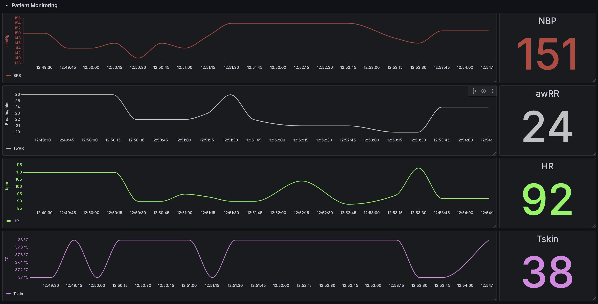
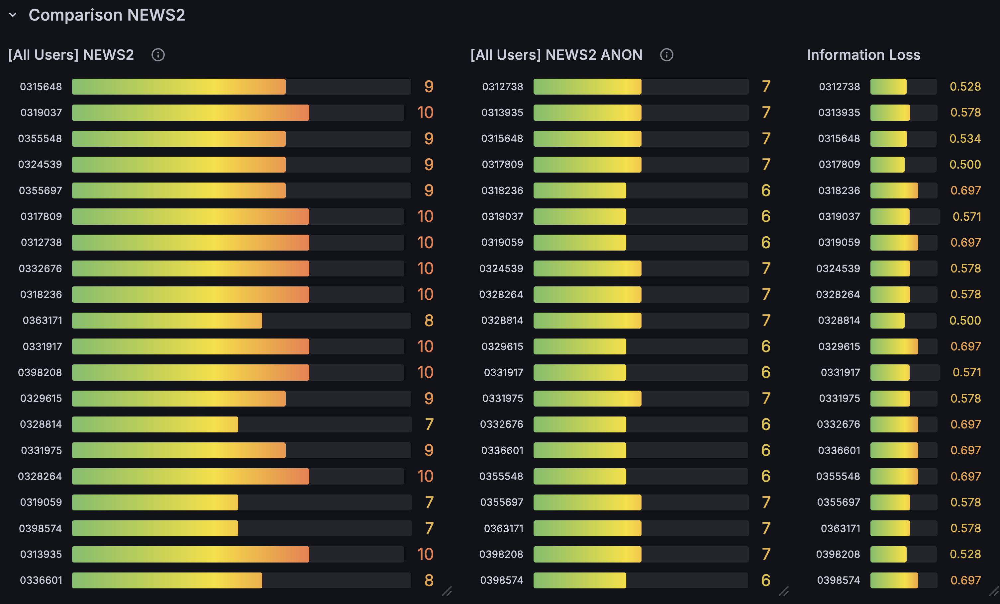
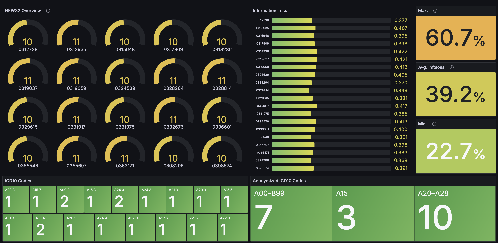
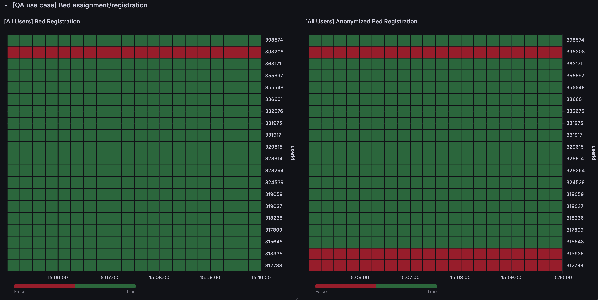
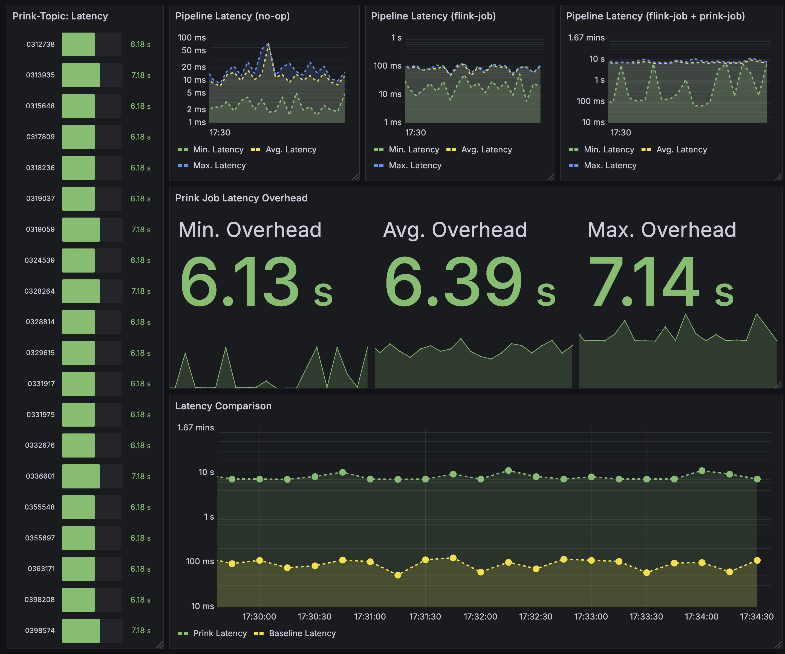

# Anonymization of Medical Data Streams using [Prink](https://github.com/PrivacyEngineering/prink)


---
## Overview
This repository contains a demo application for a Master's thesis project focused on the anonymization of medical data streams using [Prink](https://github.com/PrivacyEngineering/prink). The application consists of dockerized microservices to stream medical data and perform in-transit anonymization.

<details>
<summary><strong>Architecture Diagram</strong></summary>


</details>

### Key Features
- **Dockerized microservices**
- **Streaming medical data**
- **In-transit anonymization using [Prink](https://github.com/PrivacyEngineering/prink)**

---


## Getting Started

### Prerequisites

- [Docker](https://www.docker.com/)
- [Docker Compose](https://docs.docker.com/compose/)

### Build & Run
```bash
docker compose up --build
```

| Service         | URL                                                               | Default Credentials      |
|-----------------|-------------------------------------------------------------------|-------------------------|
| Prink Overview  | [http://localhost:8081/#/overview](http://localhost:8081/#/overview) | -                       |
| Grafana         | [http://localhost:3000/login](http://localhost:3000/login)           | `admin` / `admin`       |
| Prometheus      | [http://localhost:9090/query](http://localhost:9090/query)           | -                       |
> **Note:** To log in to Grafana, use credentials `admin/admin`, then choose `skip`.

### ...When finished
```bash
docker compose down
```
<details>
<summary><strong>Dashboard Views</strong></summary>









</details>

### Configuration

#### Privacy Parameters

| Parameter | Default Value |
|-----------|---------------|
| `k`       | 5             |
| `l`       | 3             |
| `delta`   | 125           |
| `beta`    | 50000         |
| `zeta`    | 10000         |
| `mu`      | 100           |

> **Note:** The consumer properties (connecting Prink to other topics) can be configured in the [GangesEvaluation.java Prink Job](og-prink/src/main/java/ganges/GangesEvaluation.java) file.

#### Prink Kafka consumer properties
- `bootstrap.servers`: Kafka broker addresses.
- `group.id`: Consumer group ID.
- `key.deserializer`: Deserializer for the message key.
- `value.deserializer`: Deserializer for the message value.

> **Note:** The consumer properties (connecting Prink to other topics) can be configured in the [GangesEvaluation.java Prink Job](og-prink/src/main/java/ganges/GangesEvaluation.java) file.

#### Flink Configuration
- The Flink configuration file is located at `flink-conf.yaml`.
- Key configurations include:
  - `jobmanager.rpc.address`: Address of the job manager.
  - `taskmanager.numberOfTaskSlots`: Number of task slots per task manager.

## Third-Party Licenses
This project uses third-party components:
- Apache Kafka, Zookeeper, Flink, Prometheus (Apache 2.0)
- Grafana (AGPL v3)

These components are used as-is via container images. 

## License

This repository’s own source code is licensed under the [MIT License](LICENSE).

